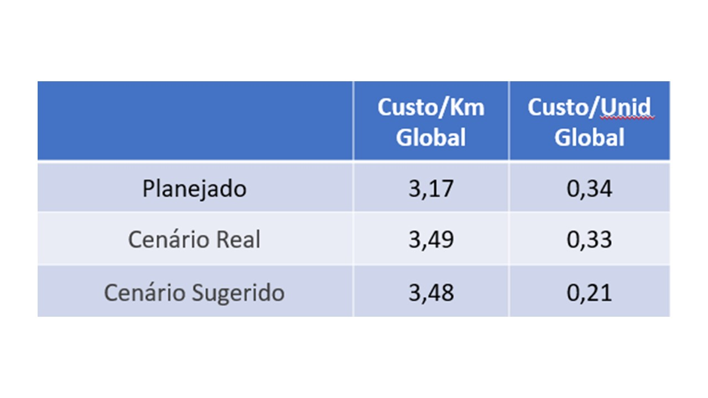

# Avaliação dos Custos Logísticos de Distribuição em Rotas

 
API 6° Semestre - Logística Noturno

 

   
 
 

## O Projeto

Este projeto de roteirização consiste em, com base nos dados oferecido pelo cliente, otimizar as rotas de entregas entre as fábricas e os clientes. A proposta de nossa analise é fornecer ao cliente uma soluções logísticas para otimização das rotas e redução do custos, através de uma base de dados fornecida pelo cliente.

O objetivo geral foi o desenvolvimento de uma interface gráfica que permita ao cliente uma consulta das informações tratadas pela sua base de dados, o produto foi pensado e desenvolvido para ser de fácil interatividade, ágil e com gráficos visuais pertinentes para analisar os indicadores logísticos, oferecemos também ao cliente uma sugestão de um cenário onde os parâmetros logísticos possam ser melhorados por meio da inclusão de um centro de distribuição e avaliamos a eficiência das rotas de venda de ambos cenários, sendo o pirmeiro o real com a base de dados oferecida e o segundo o sugerido com a nova base de dados modelada com o centro de distribuição fazendo parte das rotas.  

(<a href="#top">voltar ao topo</a>)

## A Empresa

      

  
A **GETLOG** tem como missão realizar consultorias de maneira eficiente e ágil, proporcionando melhorias aos nossos clientes e auxiliando-os por meio da entrega de produtos eficientes e eficazes para a resolução de seus problemas.
  
> A Equipe
  
| Avatar            							| Aluno         | Função           		
| -------------------------------------------- | ---------------- | ---------------- 
| |__Jessica Tinoco Bernardo__  | *Scrum Master*  
| |__Giovani Lavinas Ramos__| *Product Owner* 
| |__André Donizetti__  | *Developer Team*  
| |__Larissa Aparecida Claro__  | *Developer Team* 
| |__Emanuelle Aparecida G. da Silva__ | *Developer Team* 
 
 
(<a href="#top">voltar ao topo</a>)

  
## Objetivo

A demanda do cliente consiste em entender e avaliar da melhor forma possível a distribuição e os custos das rotas dentro de uma base de dados com uma origem e um destino de entrega de produtos.

Assim, tem-se por objetivo específico:

• Desenvolver uma interface gráfica que permita o cliente consultar, filtrar e agrupar as informações tratadas da base de dados do governo

• Avaliar os parâmetros logísticos planejados pela empresa e confrontar com os parâmetros reais obtidos pela base de dados.
  

(<a href="#top">voltar ao topo</a>)

## Solução

A equipe da GetLog além de desenvolver uma interface gráfica que permita o cliente consultar, filtrar e agrupar as informações tratadas da base de rotas oferecida, entregará o produto com análises logísticas pertinentes ao projeto.

(<a href="#top">voltar ao topo</a>)

## Organização e Metodologia
  
Este projeto foi realizado conforme a metodologia ágil, utilizando o software Jira para a organização e acompanhamento das tarefas de cada membro da equipe; durante cada sprint, uma série de atividades eram designadas, com data de início e data limite, possibilitando a análise do tempo gasto em cada uma delas, e, do desempenho dos integrantes.

> Cronograma

_Sprint 01 - 19/03/23 à 05/04/2023_

_Sprint 02 - 06/04/23 à 23/04/2023_

_Sprint 03 - 24/04/23 à 07/06/2023_

> SPRINT 01

Foi disponibilizado uma tabela com informações de rotas, fábricas e clientes. Através de programação em Python, cruzamos as três bases em uma, os dados foram analisados e apresentados ao cliente com o intuito de alinhar as expectativas.

      

> SPRINT 02
 
Com uma nova base de dados disponibilizada pelo cliente foram aplicadas regras de negócios nas bases e construído um dashboard para visualizar o resumo dos dados, bem como informações mais detalhadas.
 
Foi incluído as rotas dados de distância e tempo e calculado incicadores de custo/km e custo/tempo. 
 
 

      

 
> SPRINT 03
 
Foi disponibilizado uma tabela de parâmetros da empresa com custo/unidade e custo/km planejado.
 
Com uma nova base, calculamos os parâmetros da base real para comparação com os parâmetros planejados, incluímos uma sugestão de novo cenário de rotas com adição de um centro de distribuição entre as rotas, com estas novas rotas sugeridas, calculamos os parâmetros
para comparação com o planejado e o realizado.
Incluímos também, através do DEA, uma análise da eficiência das rotas de venda da base realizada e das rotas de venda da base sugerida.
 
 

      

 

(<a href="#top">voltar ao topo</a>)

## Resultado e Produto

Por meio de modelagem de daos, obtivemos o protótipo de dashboard executado no software QuickSight incluindo gráficos pertinentes para analisar as rotas, custos e distribuição.

Com as modelagens pertinentes encontramos e comparamos os parâmetros globais planejados pela empresa, o real com a base fornecida pelo cliente e o sugerido com a base com o centro de distribuição incluido.

 

      

### COG para Modelagem do Centro de Distribuição
 
 Utilizando as latitudes e longitudes dos clientes e fábricas da base, podemos verificar que eles se agrupam, visualmente, em 7 grandes aglomerados de pontos, por meio de uma biblioteca em Python de clusterização (KMeans) que utiliza _Machine Learning_, foi encontardo 7 clusters no centróide de cada aglomerado.
 
 Utilizando estes 7 clusters, em conjunto com a soma das demandas anuais de cada cliente incluídos nestes clusters, utilizamos a teoria do COG, presente nos livros escritos por _Ballou, Ronald H_ para encontrar a localização de um Centro de Distribuição para estas rotas.
 
 

      

 
 Para encontrar os parâmetros globais deste novo cenário e comparar com o que a empresa planejou, havia a necessidade de encontrar a quilometragem e o tempo de duração destas novas rotas que iriam das fábricas para o centro de distribuição e do centro de distribuição para os clientes.
 
 Utilizando Python novamente como nossa ferramenta principal, modelamos um código que utiliza a API do Google para calcular a distância entre dois pontos e a duração de uma viagem entre eles.
 
 Porém para completar os parâmetros ainda havia a necessidade de calcular o valor do frete de cada nova rota.
 
 

      

  

  
  Para o cálculo do valor do frete, analisamos a correlação de campos que poderiam ter influência neste valor, para então escolher um modelo que supriria as necessidades do próximo passo.
  

      

  

  
  Nosso próximo passo foi então, com base nos dados históricos (base real), modelar uma regressão linear que utiliza um modelo de _Machine Learnig_ supervisionado, para então prever qual seria o valor de cada rota, levando em conta não só distância, mas também como estes valores se comportavam dentro da base anual.
  
  Obtivemos então a base de nosso cenário sugerido com quilometragem de cada rota fabrica-CD e CD-cliente, assim como o valor de frete de cada uma.
  

      

  

  
 Analisando logísticamente o cenário sugerido, fizemos então a modelagem da quantidade de rotas entre a fábrica e o centro de distribuição, para tornar este cenário o mais otimizado possível e assim termos os números reais para base de comparação dos parâmetros globais do planejado pela empresa e do realizado pela base de dados do cliente.
  

      

 
 
(<a href="#top">voltar ao topo</a>)

  
## Tecnologias Utilizadas

   
 <a href="https://www.atlassian.com/software/jira">
 

 

    
 
 
 

    
 
 
 
  

(<a href="#top">voltar ao topo</a>)

  
 
 
 
 
 
 
 

